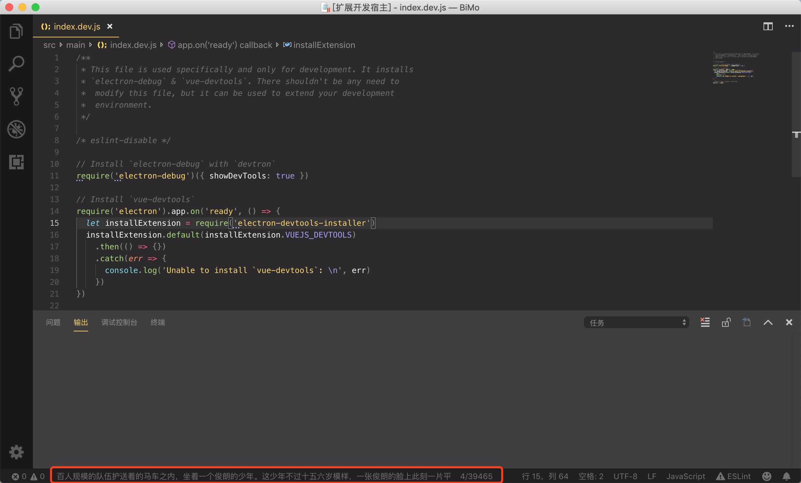
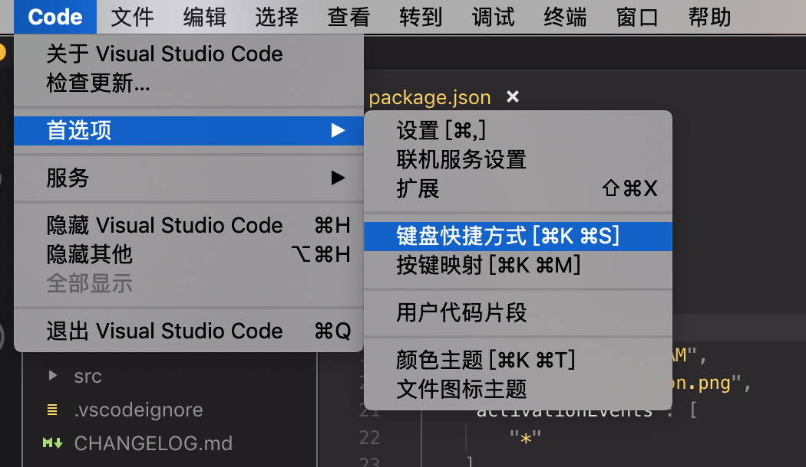
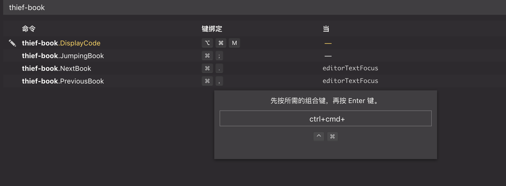

# Thief Book

一个摸鱼看书神器

## 安装

- https://marketplace.visualstudio.com/items?itemName=C-TEAM.thief-book

## PC版本

更加隐蔽功能更加丰富：https://github.com/cteams/Thief-Book

## 默认配置

> 需要填写 TXT小说 路径才可以使用此插件

- 当前页数：1
- 每页长度：50
- 是否为英文：false 如果是英文小说，请勾选
- 换行分隔符号：一个空格 
- TXT绝对路径：空

## 路径格式

- **Mac** or **Linux** : /opt/test/name.txt
- **Win** : C:\\\Users\\\Administrator\\\Desktop\\\name.txt or C:/Users/Administrator/Desktop/name.txt

## 快捷键

> 没有设置TXT小说的本地绝对路径，会报错，会提示设置路径

**MAC**

`Cmd+M` 老板键 。 随机显示不同语言的 Hello World ，随时可用

`Cmd+,` 上一页 。 文本聚焦(编辑代码)的时候，才可以使用

`Cmd+.` 下一页 。 文本聚焦(编辑代码)的时候，才可以使用

`Cmd+;` 跳转 。 文本聚焦(编辑代码)的时候，需要设置跳转页面，才可以使用

**WIN**

`Ctrl+M` 老板键 。 随机显示不同语言的 Hello World ，随时可用

`Ctrl+Alt+,` 上一页 。 文本聚焦(编辑代码)的时候，才可以使用

`Ctrl+Alt+.` 下一页 。 文本聚焦(编辑代码)的时候，才可以使用

`Ctrl+Alt+;` 跳转 。 文本聚焦(编辑代码)的时候，需要设置跳转页面，才可以使用

## 修改快捷键

---

A fishing and reading magic weapon

## Install

- https://marketplace.visualstudio.com/items?itemName=C-TEAM.thief-book

## PC

https://github.com/cteams/Thief-Book

## Default configuration

> You need to fill in the TXT novel path to use this plug-in

- Current Page: 1
- Length per page: 50
- Is English：false  If it's an English novel, please check it out.
- Line Break Separation Symbol：A space
- TXT Absolute Path: null

## Path format

- **Mac** or **Linux** : /opt/test/name.txt
- **Win** : C:\\\Users\\\Administrator\\\Desktop\\\name.txt or C:/Users/Administrator/Desktop/name.txt

## Shortcut keys

> If there is no absolute local path for TXT fiction, errors will be reported and paths will be prompted.

**MAC**

`Cmd+M` Boss key. randomly displays Hello World in different languages , Available at any time

`Cmd+,` Previous page. When text is focused (editing code) , Only then can it be used

`Cmd+.` Next page . When text is focused (editing code) , Only then can it be used

`Cmd+;` Jump page . When focusing on text (editing code), jump pages need to be set before you can use them

**WIN**

`Ctrl+M` Boss key. randomly displays Hello World in different languages , Available at any time

`Ctrl+Alt+,` Previous page. When text is focused (editing code) , Only then can it be used

`Ctrl+Alt+.` Next page . When text is focused (editing code) , Only then can it be used

`Ctrl+Alt+;` Jump page . When focusing on text (editing code), jump pages need to be set before you can use them

## Update Shortcut keys

**Enjoy!**